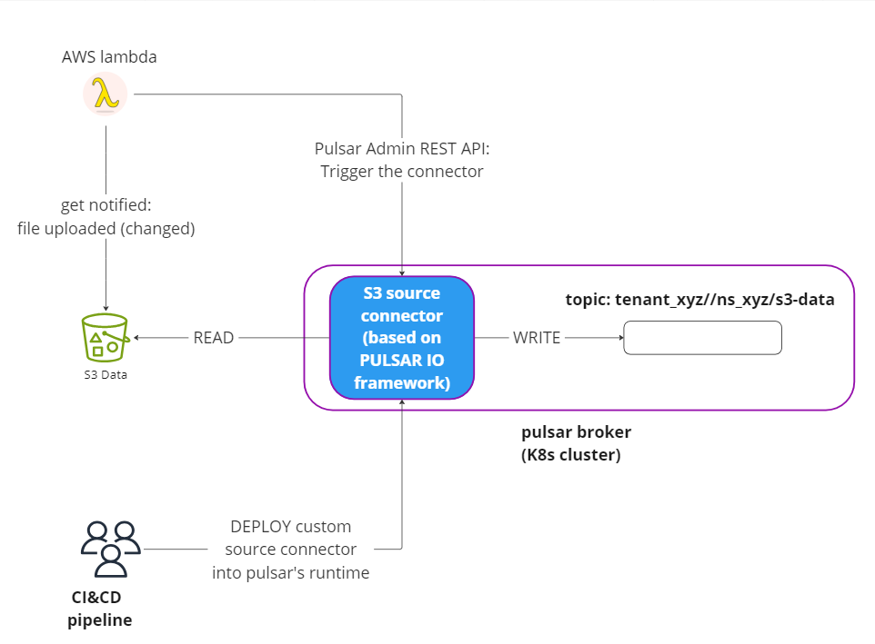

# Introduction

This project explores Pulsar IO framework. We are building a simple S3 source connector and deploying it into a pulsar cluster,

The connector (source code in ./connector  folder)  is connecting to S3 via AWS s3 SDK, asynchronously reads all files from bucket line by line and pushes every read line into specified topic.

Below parameters are provided as command line parameters via pulsar admin cli ( see enable_connector.sh in ./custom-broker folder for details)
 * bucketName
 * region
 * topic name
 * tenant
 * namespace 


## High level view



# Build and Test Locally

### prerequisites
* install docker, docker compose
* install JAVA, Maven

## steps
1. Build custom connector (and copy jar file into broker's folder):
    ```
    cd connector && build_test_copy.sh
    ```
2. Run pulsar stack (in docker) 
    ```
    docker compose up -d
    ```

3. Stop pulsar stack (in docker) 
    ```
    docker compose down
    ```   
    (caveat: if you made changes/rebuilt the connector, you would need to rebuild custom-broker's image as well)


TL/DR; 
```
 chmod +x build&start.sh && ./build&start.sh
```