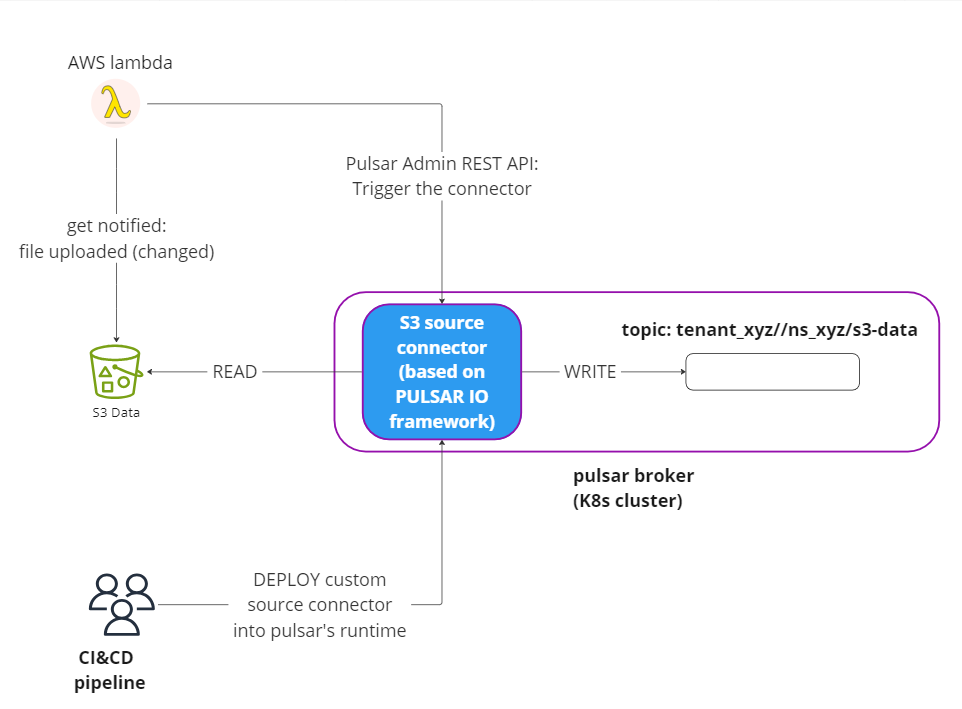

# Introduction

This project explores Pulsar IO framework. We are building a simple S3 source connector and deploying it into a pulsar cluster,

The connector (source code in ./connector  folder)  is connecting to S3 via AWS s3 SDK, asynchronously reads all files from bucket line by line and pushes every read line into specified topic.

Below parameters are provided as command line parameters via pulsar admin cli ( see enable_connector.sh in ./custom-broker folder for details)
 * bucketName
 * region
 * topic name
 * tenant
 * namespace 


## High level view



# Build and Test Locally

### prerequisites
* install docker, docker compose
* install JAVA, Maven

## steps

Open command prompt in root directory of the repository, then:

1. Build custom connector (and copy jar file into broker's folder):
    ```
    cd ./connector && build_test_copy.sh
    ```
    (if above command worked correctly - you should see "Welcome to s3 connector" output in console)
2. Run pulsar docker stack, from root directory :
    ```
    docker compose up -d
    ```
3. enable connector:
    ```
    cd utils
    ./enable_connector.sh
    ```
4. start connector:
    ```
    cd utils
    ./start-connector.sh
    ```
5. Run pulsar docker stack, from root directory :
    ```
    docker compose up -d
    ```        

6. Stop pulsar stack, from  root directory: 
    ```
    docker compose down
    ```   
    (caveat: if you made changes/rebuilt the connector, you would need to rebuild custom-broker's image as well)
7.  Visualisations: 
     - Simple Pulsar dashboard:
       http://localhost:80
   
    - Pulsar manager UI: http://localhost:9527 user: admin, login: apachepulsar  (to configure login/password - execute script ./utils/set-login-from-cli.sh)
      BrokerURL - URL where pulsar admin is hosted,in our case: http://pulsar-manager:8080,  Bookie: http://pulsar-manager:8080  (as we run pulsar in standalone mode) 


TL/DR; 
```
 chmod +x build_and_start.sh && ./build_and_start.sh
```