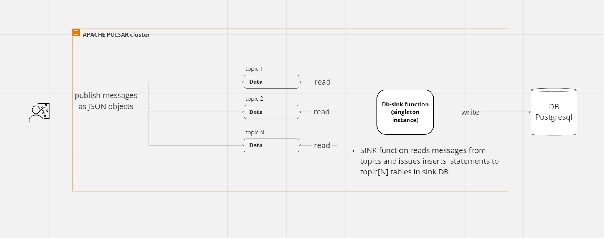

##  Introduction

In this PoC we create sink functions reading from N topics and generating DML statements ( inserts) into Postgressql DB tables. 

Sink function operates in singleton mode (--parallelism 1), benefiting from initialize method called once, there we create DbConnection pool and each subsequent message is written into DB using recycled connections from the pool.

Configuration of function is provided via  --user-config option in function deploy cli (pulsar-admin functions create cli https://pulsar.apache.org/docs/next/admin-api-functions/)

In our example: 

```
echo 'create sink function' 
docker compose exec -i pulsar-server  bin/pulsar-admin  functions create  \
  --jar /pulsar/connectors/sink-function-0.0.1.jar \
  --classname ep.DbSinkFunction \
  --tenant public  \
  --namespace default  \
  --name db-sink  \
  --parallelism 1 \
  --inputs public/default/clients,public/default/orders \
  --user-config '{"user": "usr", "password":"1234567", "dbHost":"15.5.0.3",  "port":"5432",  "dbName":"sinkdb", "poolName":"sink-func-pool" }' \
  --dead-letter-topic persistent://public/default/dlq-topic \
  --max-message-retries 3 
```
Check ./build-and-start.sh for details.

## High level view



# Build and Test Locally

### prerequisites
* install docker, docker compose

## steps to run the PoC

Open command prompt in root directory of the repository, then:


1. start the PoC ( each action inside main script below is commented and broken down by steps, each having its own script )
   ```
     ./build-and-start.sh

   ```


2. check data has ended up in Database using adminer tool using following paramters 
      POSTGRES_DB: sinkdb
      POSTGRES_USER: usr
      POSTGRES_PASSWORD: 1234567:
    
    ```
    http://localhost:8082
  
    ```

